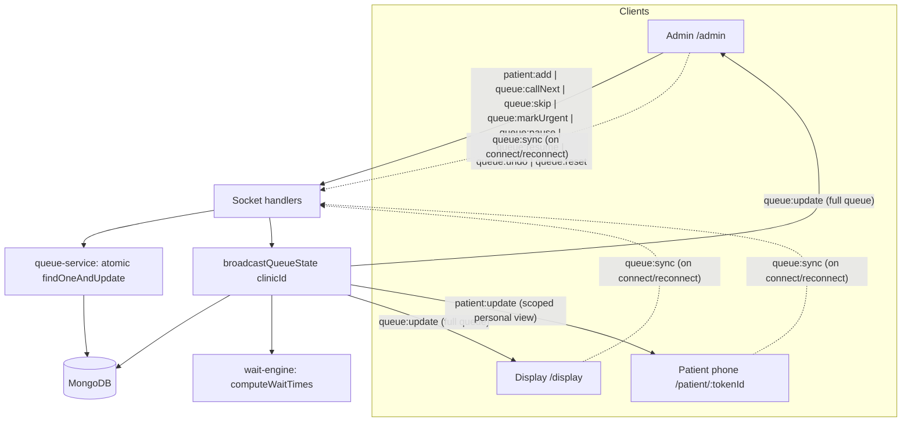
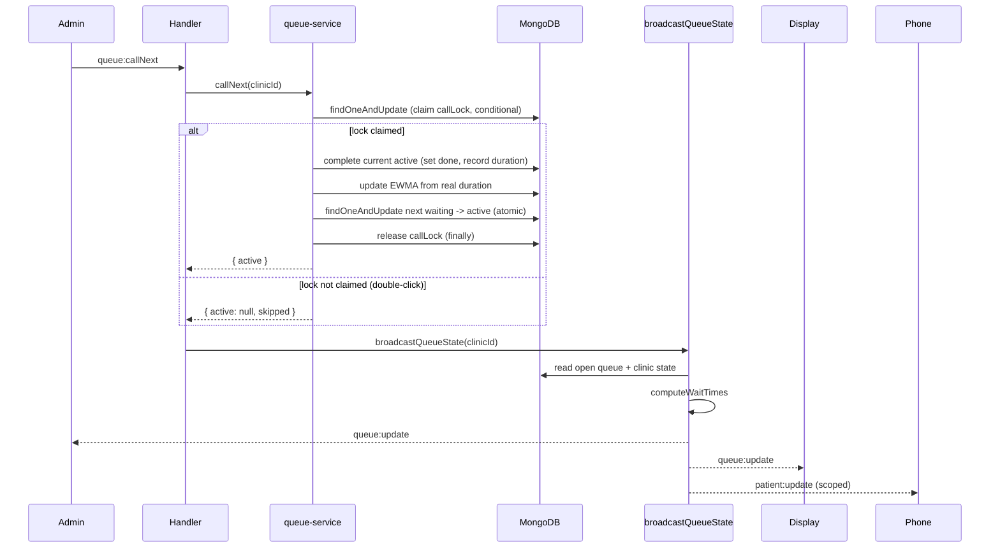

# Socket Event Flow

Every mutating event follows the same shape: a client emits an action, a single
service function performs an atomic mutation, and the one broadcast function
recomputes and pushes fresh state to every room. No handler emits queue or
patient events on its own.

## Rooms

- `clinic-001` room: the admin and the display join here and receive
  `queue:update` (the full queue, stats, and break state).
- `<tokenId>` room: each patient phone joins its own private room and receives
  only `patient:update` (its position, wait, and break status).

## The single broadcast path

## Call Next sequence (the critical path)

## Event reference

| Event (client -> server) | Direction | Effect |
| --- | --- | --- |
| `patient:add` | admin -> server | Atomically assign next token number, create waiting patient, return `{ tokenId, tokenNumber, url }`, broadcast |
| `queue:callNext` | admin -> server | Claim lock, complete active (update EWMA), atomically activate next waiting, broadcast |
| `queue:skip` | admin -> server | Re-queue active as waiting at the back (priority reset), advance, broadcast |
| `queue:markUrgent` | admin -> server | Set priority 1 + reason atomically, broadcast |
| `queue:pause` | admin -> server | Set paused + break fields, broadcast |
| `queue:resume` | admin -> server | Reset active `calledAt` (EWMA protection), clear break, broadcast |
| `queue:undo` | admin -> server | Revert last callNext incl. EWMA history, broadcast |
| `queue:reset` | admin -> server | Clear all patients and counters, broadcast |
| `queue:sync` | any -> server | Send fresh state to just the requesting socket |

| Event (server -> client) | Direction | Payload |
| --- | --- | --- |
| `queue:update` | server -> clinic room | Full queue: `active`, `waiting` (with wait estimates), `absent`, `stats`, `break`, `confidence` |
| `patient:update` | server -> token room | Scoped personal view: `tokenNumber`, `status`, `nowServing`, `ahead`, `wait`, `break` |
